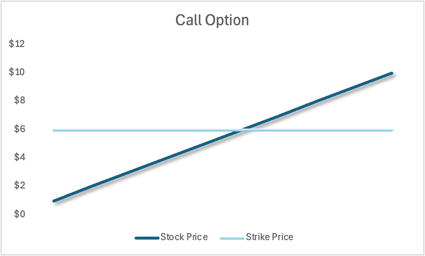
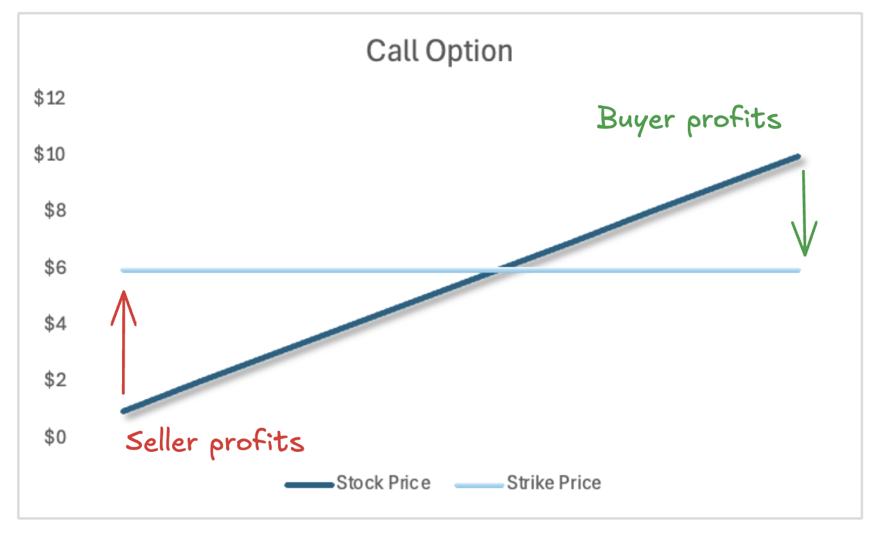
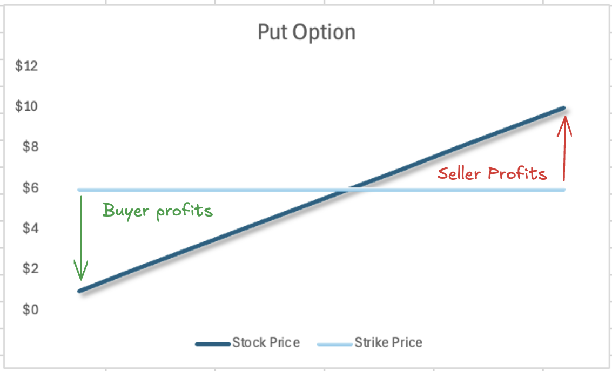
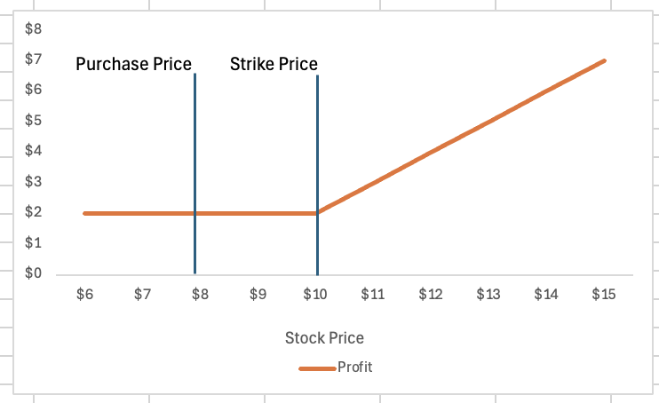

# What the hellys an option

For those who aren't familiar with an options contracts, these are financial instruments often used to protect against risk or make speculative investments.

Imagine a concert coming up, you haven't received your timetable yet and don't know if you will be able to attend. What if you could pay 10% of the original ticket price now, obtain the **option** to purchase the ticket later (at full price) if you happen to be free at the same time.

You, now have the chance to attend the party if it suits you and only risked 10% of the price versus 100%.

> Options provide buyers, the option but not the obligation to purchase something on a pre-determined price at a later date.

In financial markets the common example of this is, an option to buy stock **XYZ** at the price $**x**, in **n days**. If the underlying asset (XYZ) does not exceed the price of *$x* then there is no reason to execute the option. 

> The seller of an option receives an obligation to provide the item the option guarantees, at the pre-determined price if the option is executed.

With this information we can see, the buyer pays for an option while the seller receives money for an obligation. This is similar to insurance - you pay your car insurer a sum of money, so in the event of an accident they are obliged to compensate you a pre-determined amount.

## Leverage Through Options
> Not sure about this section.

You may have seen memes of degenerates on wallstreetbets obliterating their parents retirement funds through risky options plays.

These plays are comparable to purchasing lightning insurance, you will receive $1 million dollars if you are struck by lightning.

It's incredibly unlikely that you're going to profit from this, however no matter how small the probability is something has a chance to happen, given enough time it will happen.

This is the basis for the [infinite monkey theorem.](https://en.wikipedia.org/wiki/Infinite_monkey_theorem) ([UTS Article Challenging the theory](https://www.uts.edu.au/news/2024/10/its-not-be-universe-too-short-shakespeare-typing-monkeys))

# Why It Matters
Options help investors to navigate the markets by opening the door to many different combinations and possibilities of hedging risk and amplifying returns.

## Option Payoff Structures
In the simplest example, you buy a call option which has a strike *(purchase)* price of $6. If the price exceeds $6 then you will profit by executing the option and selling the shares directly back to the market.

So in theory, when the stock price crosses anywhere above the strike price the buyer profits. In reality we need to account for the amount paid for the option, brokerage and trading costs.

For the seller the opposite is true, as long as the stock price stays below $6 they will not be obliged to provide the stock at a discount to what the market is currently trading for.

## Payoff Caps

In the above scenario, it's theoretically possible for the stock price to continue to rise until infinity.

So the buyer purchases an option for which their losses are capped at the purchase price to infinity. The seller recieves the opposite payoff structure. 
$$
\begin{aligned}
&\text{Buyer Profit} = -p \geq x \geq \infty \\
&\text{Seller Profit} =  -\infty \geq x \geq p 
\end{aligned}
$$

* Where $p$ is the purchase price.
* $x$ is the potential profit.

Imagine the reverse is true for when you purchase a **put** option.

| Type    | Outcome |
| --- | --- |
| Call Option    | Provides the buyer an option to **buy** a stock.    |
| Put Option    | Provides the buyer an option to **sell** a stock.    |

Put options have the reverse payoff structure to call options, if this concept is foreign exploring the idea of **shorting stocks** would assist in understanding how this is profitable.

## How hedging works (The difference between buying and selling options)
- [ ]  *Show pay off charts*

Consider a scenario where you own shares in a small start up called google. Currently trading at $12. You purchased these shares at $8 and have made a decent profit of $4 per share.

If you purchased a **put** option, the opposite of a **call** option which allows you to sell a stock at a pre-determined price. Providing the buyer of the option the chance to sell google shares at $10 which you already own, and purchased at $8.

If you execute this option, you can sell your own shares at $10 resulting in a profit of $2. This is less than the current market price of $12 which would allow you to profit by $4, so that would not be logical.

What if the stock price fell to $6? You have lost all of your potential profit.

**The option locks in a minimum price ($10) you can sell the shares for, for a pre-determined period for a cost.** Hedging against downside risk and locking in some profits. The payout chart for this scenario looks like this:

## Summary

This article explained the basics of options contracts, highlighting how they give investors the right—but not the obligation—to buy or sell assets at predetermined prices. 

Options are powerful tools for managing risk, amplifying returns, and hedging against market movements. By using combinations of call and put options, investors can create complex strategies that profit from both upward and downward price movements, or even from market stability. 

This flexibility enables sophisticated speculative plays that go beyond simple buying or selling, opening up a wide range of opportunities in financial markets.
